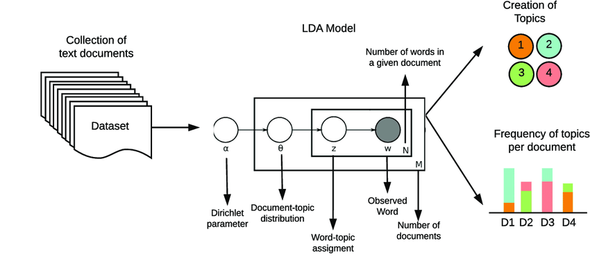

## Objectifs

Comprendre quels sont les facteurs qui sont associés à une faible ou une forte recommandation. Le cas est celui d'une chaine de jardinerie et d'une enquête menée sur sa clientèle dans les années 2010. 

On utilise deux questions principalement :

- une échelle de recommandation (de 0 à 10)
- une question ouverte sur les raison de la note.


## les packages utilisés

On utilise principalement les ressources de `quanteda` et l'analyse factorielle des correspondances avec `Factominer`

```{r setup,warning=FALSE, message=FALSE}
knitr::opts_chunk$set(echo = TRUE,include=TRUE, warning=FALSE, message=FALSE)
library(tidyverse)
library(lubridate)
library(quanteda)
library(quanteda.textplots)
library(quanteda.textstats)

library(ggwordcloud)
library(ggmosaic)
library(rcompanion)

library(cowplot)

library ("FactoMineR")
library(factoextra)


df<-read_csv("nps.csv", locale = locale(encoding = "WINDOWS-1252"))

#palette de couleur
col<-c("firebrick","Gold3","Darkgreen")
theme_set(theme_minimal())

```

## Les données

Quelques recodages

```{r data}

```

# Distribution du NPS

Notre tableau de données rend compte de près de 14000 évaluations en terme de NPS de la relation à une enseigne de jardinage. 


```{r 03}
foo1<-df %>%
  mutate(NPS=ifelse(nps<7, "Détracteurs", 
                    ifelse(nps>6 & nps<9,"Passifs", "Promoteurs")),
         mutate(p=ifelse(NPS=="Promoteurs", 1, 0),
         d=ifelse(NPS=="Détracteurs", 1, 0)))


#calcul du score NPS
d<- mean(foo1$d, na.rm=TRUE)
p<-mean(foo1$p, na.rm=TRUE)
score_nps<- round((p-d)*100,1)


g<-ggplot(foo1, aes(x=nps))+
  geom_histogram(binwidth = 1,aes(fill=NPS))+
  labs( title= " Distribution des scores NPS", 
        subtitle = paste0("Score NPS = ", score_nps), 
        caption = "n=13954", 
        y = "Fréquence")+ 
  scale_fill_manual(values=col)+
  scale_x_discrete(name="Note NPS", 
                   breaks=c("1","2","3","4","5","6","7", "8", "9", 10),
                   limits=c("1","2","3","4","5","6","7", "8", "9", 10))
g  
ggsave("NPS1.jpg", plot=last_plot(), width = 20, height = 20, units = "cm")

```

Comme nous allons traiter du texte et que celui n'est présent que dans une partie des réponses, on peut se demander s'il y a un biais. 

```{r 02b}

#library(ggmosaic)
#library(rcompanion)
#recodons les répondants

foo1 <- foo1 %>% 
  mutate(reponse=ifelse(is.na(explication), "Pas de réponse", "Réponse"))

t<-table(foo1$NPS,foo1$reponse)

chi2<-chisq.test(t)
chi<-round(chi2$statistic,2)
p<-round(chi2$p.value,3)
V<-cramerV(t, digit=3)

g1 <- ggplot(data = foo1) +
  geom_mosaic(aes(x=product(NPS ,reponse), fill = NPS))+  
  theme(axis.text.x = element_text(angle = 45, hjust = -0.1, vjust = -0.2))+ 
  theme(legend.position = "none")+
  labs(title="Un biais négatif de réponse", 
       subtitle=paste0("chi2 =",chi, " p = ", p, " - V : ", V))+    
  scale_fill_manual(values=col) 

g1
```


# Structure des corrélations

On peut examiner la corrélation de cet indicateurs à quelques autres variables : d'autres jugements, et les comportements antérieurs.


```{r 02}

foo2<-foo1 %>% select(3,4,5,7,8,9) %>% drop_na()
r<- round(cor(foo2),3)
library(ggcorrplot)
ggcorrplot(r, hc.order = TRUE, type = "lower",
   outline.col = "white",
   colors = c("#6D9EC1", "white", "#E46726"),
   lab=TRUE)

library(GGally)
ggpairs(foo2, lower = list(continuous = "smooth_loess", combo = ggally_dot_no_facet),title="correlogram with ggpairs()") 

```

##  Un petit modèle linéaire

```{r cor}
ggplot(foo1,aes(CaTicket))+geom_histogram(binwidth = 1)

ggplot(foo1,aes(CaTicket, nps))+geom_point()+geom_smooth() +scale_x_log10()
ggplot(foo1,aes(NbPassageKS, nps))+geom_point()+geom_smooth() +scale_x_log10()

ggplot(foo1,aes(t, nps))+geom_point()+geom_smooth() +scale_x_log10()

foo1<- foo1%>%mutate(CaTicket=ifelse(CaTicket<0,0,CaTicket),
                     CaTicket_l=log10(CaTicket+1))

fit<- lm(nps~log(NbPassageKS)+log(CaTicket+1)+log(t+1), foo1)
summary(fit)
library(jtools)
effect_plot(fit, pred=CaTicket, interval = TRUE)#scale_x_log10()
effect_plot(fit, pred=NbPassageKS, interval = TRUE) #+scale_x_log10()
effect_plot(fit, pred=t, interval = TRUE)#scale_x_log10()

```


## Corpus

On utilise quanteda . 

```{r 04}
# 1 définir le corpus

corpus<-corpus(foo1,text_field ="explication")

# 2 tokeniser le corpus

toks <- tokens(corpus, remove_punct = TRUE) %>% 
    tokens_remove(pattern = stopwords("fr"))%>%
   tokens_remove(pattern="Botanic.*") %>%
    tokens_group(groups = NPS)

# 3 construire le dfm 

dfm <- dfm(toks) %>%   
  dfm_trim(min_termfreq = 40, verbose = FALSE)

# 4 afficher le wordcloud

textplot_wordcloud(dfm,comparison = TRUE, color = col)

```

## Un autre wordcloud

Une autre méthode avec meilleure préparation du texte. et surtout de la collocation


pour le détail voir : https://quanteda.io/reference/textstat_collocations.html


```{r 05}

toks <- tokens(corpus, remove_punct = TRUE) %>%
  tokens_group(groups = NPS)

coloc <- textstat_collocations(toks, size = 2:4, min_count = 10) %>% filter(z>5)

coloc
head(coloc, 20)


toks2 <- tokens_compound(toks, pattern = cols) %>%     
  tokens_remove(pattern = stopwords("fr") )


dfm <-toks2 %>%
    tokens_group(groups = NPS)%>% 
  dfm()

stat<- dfm %>% 
  textstat_frequency(n = 50,  groups = NPS)

g_b<-ggplot(stat, aes(label = feature)) +
  geom_text_wordcloud(aes(size=log(frequency), color=group)) +
  theme_minimal()+
  facet_wrap(vars(group))+scale_color_manual(values=col)+ 
  labs(title="Nuage des 50 mots les plus fréquents(Par groupes",
       caption = "La taille des mots est proportionnelle au log de leurs fréquences")
g_b
ggsave("NPS3.jpg", plot=last_plot(), width = 20, height = 20, units = "cm")

```

## pour comparer les groupes, le Keyness index est particulièrement utile

Il est calculé en comparant un groupe cible à l'ensemble des autres groupes par une mesure d'association : un chi², ou un point.wise correlation.

```{r 06, fig.width=9}

# Create a dfm per group
dfm <-toks2 %>%
    tokens_group(groups = NPS)%>% 
  dfm()


# Calculate keyness and determine "Promoteurs" as target group againts all other categories
result_keyness <- textstat_keyness(dfm, target = "Promoteurs") %>% filter (n_target>20)
# Plot estimated word keyness
g1<-textplot_keyness(result_keyness,   n = 30L, labelsize = 3,   show_legend = FALSE, show_reference = FALSE,   color = c("Darkgreen", "gray"))+
  xlim(0,80) + 
  labs(x=NULL)


result_keyness <- textstat_keyness(dfm, target = "Détracteurs" )
g2<-textplot_keyness(result_keyness,   n = 30L, labelsize = 3,   show_legend = FALSE,   
                     show_reference = FALSE,   color = c("firebrick", "gray"))+
  xlim(0,80)+ 
  labs(x=NULL)


result_keyness <- textstat_keyness(dfm, target = "Passifs")
g3<-textplot_keyness(result_keyness,   n = 30L, labelsize = 3,   show_legend = FALSE,   show_reference = FALSE,    color = c("gold2", "gray"))+xlim(0,80)+ labs(x=NULL)

p<- plot_grid(g2, g3 ,g1,  labels = c('Détracteurs', 'Passifs', 'Promoteurs'), label_size = 12, ncol=3)
title <- ggdraw() + draw_label("NPS : Les raisons qui conduisent à la recommandation (keyness)", fontface='bold')
note <- ggdraw()+ draw_text("Les valeurs représentent le keyness des termes.\nIl mesure leur caractère distinctif par une statistique du chi²", size=8,x = 0.5, y = 0.5)
plot_grid(title, p,note, ncol=1, rel_heights=c(0.1, 1)) # rel_heights values control title margins


ggsave("NPS4.jpg", plot=last_plot(), width = 20, height = 20, units = "cm")
#  pour une comparaison deux à deux
#   pres_corpus <- corpus_subset(corpus, NPS %in% c("Détracteurs", "Promoteurs"))


plot_grid(g ,p,d, labels = c("", "", "", ""), label_size = 12, ncol = 2, nrow = )

ggsave("NPS5.jpg", plot=last_plot(), width = 20, height = 20, units = "cm")


```

## un peu de topic analysis



```{r 07, fig.width=9}
# pre processing : 
toks <- tokens(corpus, remove_punct = TRUE)

cols <- textstat_collocations(toks, size = 2:4, min_count = 5) %>%filter(z>20)

toks2 <- tokens_compound(toks, pattern = cols) %>%     
  tokens_remove(pattern = stopwords("fr") ) 

dfm<-dfm(toks2)


library(seededlda)
set.seed(007)
tmod_lda <- textmodel_lda(dfm, k = 8)
#lister les mots les plus associés
terms(tmod_lda, 25)

```

## une bonne vieille analyse des correspondances

pour plus de détail regarder par exemple [ Anne B Dufour ](https://pbil.univ-lyon1.fr/R/pdf/add2.pdf)

```{r 08, fig.width=9}
#un peu de recodage
dfm$topic <- topics(tmod_lda)
table(dfm$topic)

#on recode pour une meilleure lecture
dfm$topic2[dfm$topic=="topic1"]<-"Attente caisse"
dfm$topic2[dfm$topic=="topic2"]<-"Magasin"
dfm$topic2[dfm$topic=="topic3"]<-"Absence"
dfm$topic2[dfm$topic=="topic4"]<-"carte de fidélité"
dfm$topic2[dfm$topic=="topic5"]<-"achat"
dfm$topic2[dfm$topic=="topic6"]<-"Compétence amabilité"
dfm$topic2[dfm$topic=="topic7"]<-"prix"
dfm$topic2[dfm$topic=="topic8"]<-"choix des plantes"

table(dfm$topic2)

#le tableau croisé

ca<- table(dfm$topic2, dfm$NPS)
prop.table(ca, 2)

#library ("FactoMineR")
#library(factoextra)
res.ca <- CA (ca, graph = FALSE)
fviz_ca_biplot (res.ca, repel = TRUE)


theta<-tmod_lda$theta
```

